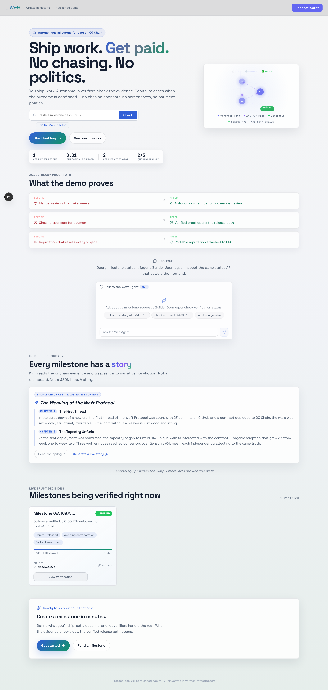
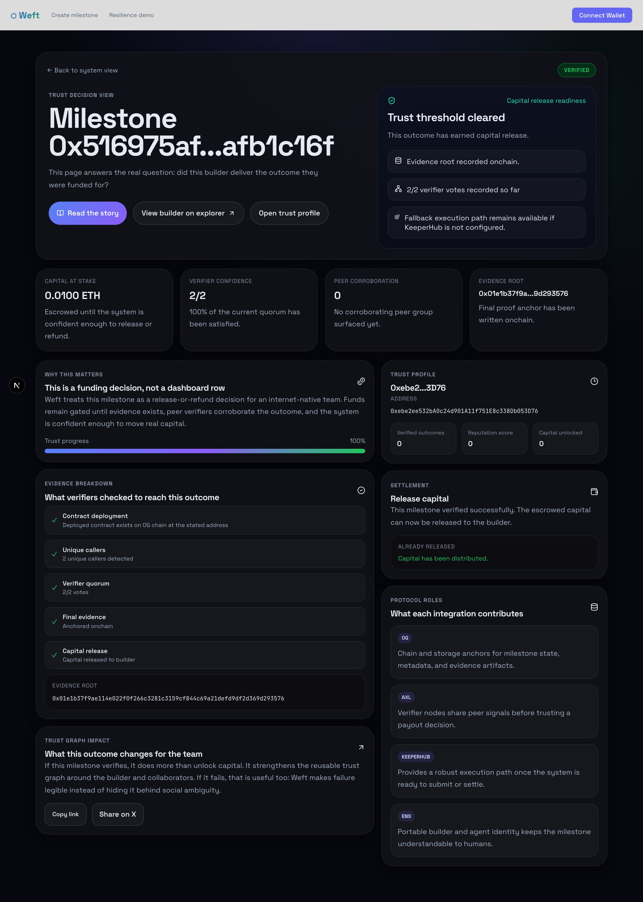
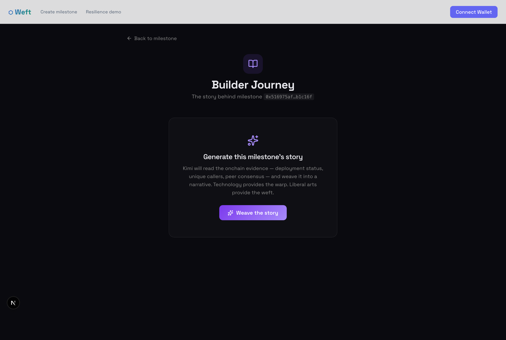

# Weft

**Escrow that releases itself.**

A sponsor locks ETH behind a deliverable. The builder ships. Autonomous agents verify
the work onchain — and if 2 of 3 agree, capital releases instantly. No manual reviews.
No chasing sponsors. No payment politics.

The agent earns 3% of every milestone it verifies, uses that revenue to pay for its own
infrastructure (LLM inference, image generation, onchain execution), and runs as a
self-sustaining company. Verified outcomes attach to the builder's ENS identity as
portable reputation.

## Live demo

| Surface | URL |
|---|---|
| **Frontend** | [weft.thisyearnofear.com](https://weft.thisyearnofear.com) |
| **Verification Explorer** | [weft.thisyearnofear.com/explorer](https://weft.thisyearnofear.com/explorer) |
| **Agent Operations** | [weft.thisyearnofear.com/operations](https://weft.thisyearnofear.com/operations) |
| **Sponsor Dashboard** | [weft.thisyearnofear.com/sponsor](https://weft.thisyearnofear.com/sponsor) |
| **Activity Feed** | [weft.thisyearnofear.com/activity](https://weft.thisyearnofear.com/activity) |
| **Verifier Network** | [weft.thisyearnofear.com/verifiers](https://weft.thisyearnofear.com/verifiers) |
| **API Docs** | [weft.thisyearnofear.com/api/docs](https://weft.thisyearnofear.com/api/docs) |
| **Builder Profile** | [weft.thisyearnofear.com/builder/weft.thisyearnofear.eth](https://weft.thisyearnofear.com/builder/weft.thisyearnofear.eth) |
| **Resilience demo (in Operations)** | [weft.thisyearnofear.com/operations](https://weft.thisyearnofear.com/operations) |
| **Explorer** | [WeftMilestone on 0G Galileo](https://explorer-testnet.0g.ai/address/0x9f66158c560ce5c8b40820fdcd2874ff8d852192) |
| **Confidential demo (Zama FHE)** | [Sealed-ballot milestone on Sepolia](https://weft.thisyearnofear.com/project/0xc351d2446c4e245d3baa0fc206a05d61010589dd8635c844c17955d50fc58574?confidential=1) — click "Decrypt sealed result" |
| **Confidential contract** | [WeftMilestoneConfidential on Sepolia](https://sepolia.etherscan.io/address/0xcd1a64733a7b58efc8914dde45fe6af22381368f) |
| **ENS identity** | `weft.thisyearnofear.eth` |
| **Status API** | `GET /api/status/demo` |
| **TestSprite tests** | 40 tests across CLI + MCP (see [LOOP.md](LOOP.md)) |

### Demo milestone (verified, finalized, released)

Paste `0x516975afcb46acf3ea2265789ea0a64516db9f1d8e6cfb65737fc9cfafb1c16f` into the
hero lookup at **[weft.thisyearnofear.com](https://weft.thisyearnofear.com)** to see
the live verification result, or click the "Try" chip.

| Field | Value |
|---|---|
| verified | ✅ |
| finalized | ✅ |
| released | ✅ |
| verifier quorum | 2 of 3 |
| capital released | 0.01 ETH |
| evidence root | `0x01e1b3...` |
| contract | `0x9f66158c560ce5c8b40820fdcd2874ff8d852192` |
| builder | `weft.thisyearnofear.eth` |

### Demo walkthrough (screenshots)

| Page | Screenshot |
|---|---|
| **Landing page** — hero section with milestone lookup widget, live stats "Verified / 0.01 ETH released / 2 verifier votes / 2/3 quorum", and verifier path diagram. |  |
| **Milestone detail** — fully loaded onchain data for the demo milestone: capital at stake (0.01 ETH), verifier confidence (2/2), evidence root anchored onchain, Evidence breakdown (5 rows: deployment, callers, quorum, evidence root, capital release), Trust profile sidebar, and Settlement panel showing release status. |  |
| **Chronicle story page** — the Builder Journey narrative for this milestone, with Kimi-generated storytelling about the verification flow. Scroll-driven chapter reveals with a reading-progress bar. Click "Weave the story" to generate. |  |

> **⏯ Full demo recording:** [`assets/demo-recording.webm`](assets/demo-recording.webm) (4.1 MB, ~30s)

### Confidential milestones — sealed-ballot consensus (Zama FHE)

Milestones can now be created **confidential**: verifier agents encrypt their votes
client-side with the [Zama Protocol](https://docs.zama.org), and the contract tallies
them homomorphically on Sepolia — `FHE.add` on the encrypted count, `FHE.ge` for the
2-of-3 quorum check. **No individual vote is ever decrypted**, which makes verifier
herding (late voters copying early ones) cryptographically impossible. Only the final
verified/rejected boolean becomes publicly decryptable, and only after every ballot is
cast — try the "Decrypt sealed result" button on the
[live confidential demo milestone](https://weft.thisyearnofear.com/project/0xc351d2446c4e245d3baa0fc206a05d61010589dd8635c844c17955d50fc58574?confidential=1).

- Contract: [`contracts/src-fhe/WeftMilestoneConfidential.sol`](contracts/src-fhe/WeftMilestoneConfidential.sol) — live on Sepolia at [`0xcd1a6473...368f`](https://sepolia.etherscan.io/address/0xcd1a64733a7b58efc8914dde45fe6af22381368f)
- Details: [SUBMISSION.md](SUBMISSION.md) — Zama Developer Program S3, Builder Track

### Quick links
- [Architecture Diagram](docs/architecture-diagram.svg)
- [Zama submission details](SUBMISSION.md)
- [Agent Workflow](AGENTS.md)
- [Product Plan](docs/product-plan.md)

> *"Technology provides the warp. Liberal arts provide the weft."*
>
> In weaving, the **weft** is the horizontal thread that interlaces with the vertical warp
> to create fabric. In this protocol, raw data threads — onchain events, GitHub commits,
> peer verdicts — are woven into meaningful outcomes: verified milestones, capital released,
> portable ENS reputation.

## The wedge

Most early teams coordinate funding with a broken combination of:
- Telegram chats
- Notion checklists
- screenshots in DMs
- multisig payout politics
- no portable reputation

Weft replaces that with a capital coordination system built for internet-native teams:
1. A sponsor or DAO defines a milestone and escrows capital
2. Builders work toward the objective
3. Verifier agents gather evidence when the milestone window closes
4. Peer nodes corroborate the outcome (2-of-3 quorum)
5. Capital releases automatically when quorum confirms delivery
6. The builder retains portable reputation tied to funded outcomes

## Why this matters

Weft enables four things that normally require corporations, lawyers, and managers:

| Primitive | Replaced by |
|---|---|
| Identity / CV | ENS text records and portable Weft reputation |
| Funding / equity | `WeftMilestone.sol` milestone escrow |
| Verification / managers | autonomous verifier swarm |
| Settlement / payroll | KeeperHub-backed capital release |

## Who it is for

### Founders, sponsors, and DAOs
- release capital without manual payout review
- reduce milestone disputes
- fund faster with more confidence
- keep auditable evidence trails

### Contributors
- earn portable reputation from funded outcomes
- work pseudonymously or agentically
- prove impact without relying on a résumé or screenshots
- participate in teams that form and dissolve quickly

### Internet-native teams
- coordinate without requiring formal company structure first
- mix human and agent contributors in the same trust graph
- turn shipped work into reusable trust for future funding

## Integration partners

| Partner | What Weft uses | Why it matters |
|---|---|---|
| **0G** | 0G Chain, metadata lookup via indexer, 0G Storage bundle/evidence publishing | Milestones, metadata, evidence roots, and downloadable attestation artifacts live in the same workflow |
| **Gensyn / AXL** | Peer broadcast, signed verdict envelopes, offchain corroboration | Separate verifier nodes coordinate before voting; no central coordinator |
| **KeeperHub** | Reliable `submitVerdict()` execution with retry/audit trail | Agents can reason about a verdict and still need a robust path to execute it onchain |
| **ENS** | Builder / verifier profile records and discoverability | Human-readable identity and portable reputation for builders and agents |
| **Hermes + Kimi** | Managed agent layer, narrative generation, Builder Journey chronicles | Weaves raw data threads into meaningful fabric — creative non-fiction from the blockchain |
| **HydraDB** | Operational memory for failure events and recovery insights | The agent captures every infrastructure failure as experience and recalls patterns to improve autonomous recovery |

## What is different about Weft

### 1. Capital moves on evidence, not vibes
Weft is not task tracking. It is a **capital release system**. Money stays gated until evidence clears a threshold.

### 2. Humans and agents are first-class contributors in the same system
Most tools still treat agents as assistants. Weft treats them as economic actors that can contribute to outcomes and accumulate track record.

### 3. Reputation is tied to funded outcomes
A milestone completing is useful. A milestone completing and unlocking real capital is a much stronger signal.

### 4. Flexible verification, onchain consequences
Weft sits between rigid smart contracts and messy manual review: offchain evidence gathering with onchain finality.

## Demo surfaces

### 1. Live frontend

Visit **https://weft.thisyearnofear.com**:
1. Landing page hero → `ChronicleShowcase` (sample narrative) → `AskWeft` chat widget
2. Milestone cards → **"Read the story"** → `/milestone/<hash>/story`
3. AskWeft chat: `"tell me about milestone 0x5169..."`
4. `/api/status/demo` — milestone state with integration status
5. `app.ens.domains/weft.thisyearnofear.eth` — builder reputation records
6. `/recovery` — autonomous failure recovery dashboard with live event timeline

### 2. Hermes Agent (most immersive)

```bash
bash scripts/hermes_weft.sh
# then type:
run the demo
```

### 3. Staged shell (video recording)

```bash
bash scripts/demo_e2e.sh \
  --milestone=0x516975afcb46acf3ea2265789ea0a64516db9f1d8e6cfb65737fc9cfafb1c16f \
  --staged --hermes
```

## Hermes Agent architecture

Weft's verification layer is a deterministic agent loop with optional managed Hermes surfaces. In the full configuration, multiple verifier nodes run the same logic and coordinate before voting. Each node can maintain persistent memory via 0G Storage and runs a continuous goal-driven loop:

1. **Polls** onchain milestones past their deadline via `DeadlineScheduler`
2. **Collects** deterministic evidence (deployment check + unique caller count + GitHub commits)
3. **Persists** real-time state and artifact pointers to **0G Storage KV** when configured
4. **Generates** a human-readable narrative from raw attestation data using **Kimi** (`moonshot-v1-128k`)
5. **Weaves** a Builder Journey chronicle — multi-chapter narrative with fal.ai milestone achievement cards
6. **Broadcasts** signed verdict envelopes to peer nodes via **AXL** encrypted P2P transport
7. **Waits** for peer consensus threshold before submitting (offchain safety gate)
8. **Submits** onchain votes via **KeeperHub** (with `cast send` fallback)
9. **Updates** builder's **ENS** text records with verified achievement summary
10. **Publishes** evidence bundles + consensus proofs + chronicle to **0G Storage**

### 0G Storage memory architecture

The Hermes Agent uses both 0G Storage primitives:

| Layer | Key pattern | Purpose |
|---|---|---|
| **KV (real-time state)** | `weft:milestone:<hash>:state` | Current verification state — fast lookup for the agent's working memory |
| **KV (latest evidence)** | `weft:milestone:<hash>:latest` | Pointer to the most recent evidence root in 0G Log |
| **KV (consensus)** | `weft:milestone:<hash>:consensus` | Consensus proof root — which peer nodes agreed |
| **KV (bundle)** | `weft:milestone:<hash>:bundle` | Full attestation bundle root (attestation.json + chronicle + cards) |
| **Log (history)** | `weft:milestone:<hash>:history` | Append-only event log — every state change, verdict, and narrative update |
| **Log (chronicle)** | `weft:milestone:<hash>:chronicle` | Builder Journey narrative — the creative layer woven from onchain threads |

This mirrors the exact architecture 0G describes: **KV for real-time state, Log for conversation/history**.

```text
┌──────────────────────────────────────────────────────────────────┐
│                      0G Galileo Testnet                         │
│  WeftMilestone: 0x9f66...1922  VerifierRegistry: 0x1356...e34a  │
└──────────┬───────────────────────────────────────┬──────────────┘
           │  poll deadlines                       │  submitVerdict
           ▼                                       ▼
┌──────────────────────┐              ┌────────────────────────┐
│   Hermes Agent Node  │◄─── AXL ────►│  Hermes Agent Node 2   │
│   (Digital Twin)     │  encrypted   │  (peer corroboration)  │
│                      │  P2P mesh    │                        │
│  DeadlineScheduler   │              │  DeadlineScheduler     │
│  mvp_verifier        │              │  mvp_verifier          │
│  github_client       │              │  github_client         │
│  kimi_client ────────┼──────────────┼──► Kimi narrative      │
│  fal_client ─────────┼──────────────┼──► fal.ai swatch       │
│  chronicle ──────────┼──────────────┼──► Builder Journey     │
│  ens_client ─────────┼──────────────┼──► ENS text records    │
│  keeperhub_client ───┼──────────────┼──► KeeperHub verdict   │
└──────────┬───────────┘              └────────────────────────┘
           │
           ▼
┌──────────────────────────────────────────────────────────────────┐
│                      0G Storage                                 │
│  KV: weft:milestone:<hash>:state    ← real-time agent memory    │
│  KV: weft:milestone:<hash>:latest   ← evidence root pointer     │
│  KV: weft:milestone:<hash>:consensus← peer consensus proof      │
│  KV: weft:milestone:<hash>:chronicle← Builder Journey cache     │
│  Files: attestation + consensus + bundle roots                  │
└──────────────────────────────────────────────────────────────────┘
```

## AXL peer-to-peer verdict consensus

Weft uses **AXL** (Gensyn's Agent eXchange Layer) for encrypted P2P verdict broadcast between verifier nodes. Each node runs a **separate AXL instance**; verdicts are signed and broadcast to peers via AXL's encrypted mesh — no central coordinator, no cloud, no accounts.

### How it works

1. Each verifier daemon calls `start_axl_node()` on startup — auto-generates an ephemeral ed25519 key and connects to Gensyn bootstrap peers
2. After collecting evidence, the node signs its verdict envelope and calls `broadcast_verdict()` — routes through `POST /send` on the local AXL HTTP API with `X-Destination-Peer-Id` header
3. Peer nodes receive envelopes via `GET /recv` drain loop and persist to `agent/.inbox/`
4. When `AXL_WAIT_FOR_PEERS=1`, a node waits for `AXL_PEER_THRESHOLD` matching envelopes before submitting onchain — offchain safety gate before the contract's 2-of-3 quorum

> Note: The live demo currently runs a single AXL node. For the full multi-node consensus demo with encrypted P2P verdict exchange between 3 separate nodes, run `bash scripts/demo_e2e.sh --nodes=3` locally. The AXL client code and peer inbox logic are fully implemented in `agent/lib/axl_client.py` and `agent/lib/peer_inbox.py`.

### Multi-node demo

```bash
# Node 1 (verifier A)
AXL_PORT=9101 AXL_BROADCAST=1 AXL_PEERS="http://localhost:9102" python3 agent/scripts/weft_daemon.py --once

# Node 2 (verifier B) — separate process, separate AXL instance
AXL_PORT=9102 AXL_BROADCAST=1 AXL_PEERS="http://localhost:9101" python3 agent/scripts/weft_daemon.py --once
```

Each node communicates exclusively through its local AXL instance — encrypted, peer-discovered, no shared message broker.

## Demo surfaces

### 0. Live frontend (primary demo surface)

`https://weft.thisyearnofear.com` — the full product, live:

| Surface | URL | What it shows |
|---|---|---|
| Landing page | `/` | Hero with animated consensus visualization, `ChronicleShowcase` (sample narrative), `AskWeft` chat widget |
| Builder passport | `/builder/weft.thisyearnofear.eth` | ENS resolution → milestone history |
| Milestone story | `/milestone/<hash>/story` | Kimi chronicle + Manim animation (cached in `localStorage`) |
| Status API overview | `/api/status/demo` | Milestone state, sponsor integration status, AXL peer inbox state |
| MCP tools | `/api/mcp/tools` | Lists chronicle, status, verify tools for MCP clients |
| MCP invoke | `/api/mcp/invoke` | `POST {tool, args}` — invoke any Weft skill programmatically |
| Chat | `/api/chat` | `POST {message}` — conversational agent interface |
| Chronicle generate | `/api/chronicle/generate` | `POST {milestoneHash}` — on-demand Kimi chronicle |

### 1. Status API / landing page

Run:
```bash
ETH_RPC_URL="http://127.0.0.1:8545" \
WEFT_CONTRACT_ADDRESS="0x..." \
ZERO_G_INDEXER_RPC="https://..." \
WEFT_BUILDER_ENS="builder.eth" \
WEFT_AGENT_ENS="verifier.eth" \
python3 agent/scripts/weft_status_api.py --port 9010
```

Open:
- `http://localhost:9010/`
- `http://localhost:9010/demo`
- `http://localhost:9010/milestone/<hash>?includeMetadata=1`

The milestone payload includes a `demo` section that surfaces:
- **0G** metadata and evidence-root context
- **Gensyn / AXL** peer corroboration state from `agent/.inbox/`
- **KeeperHub** execution-path configuration
- **ENS** builder / agent profile visibility
- **fal.ai** AI-woven milestone swatch and chronicle cover

### 2. Hermes skills

Weft's 9 skills auto-load into Hermes via `external_dirs` — no manual `Load` prompts needed.

```bash
# One-time setup (installs Hermes, wires skills, writes SOUL.md)
bash setup-hermes.sh

# Launch Hermes with all Weft env vars pre-loaded
bash scripts/hermes_weft.sh
```

Then use natural language:
```text
tell me the story of the Weft Protocol
```
```text
verify milestone 0x516975afcb46acf3ea2265789ea0a64516db9f1d8e6cfb65737fc9cfafb1c16f
```
```text
what is the status of weft.thisyearnofear.eth?
```
```text
generate a chronicle for my builder journey
```

Skills loaded: `weft-chronicle`, `weft-demo`, `weft-manim`, `weft-verify`, `weft-narrate`, `weft-status`, `weft-ens`.
Hermes identity is defined in `~/.hermes/SOUL.md` (written by `setup-hermes.sh`).

| Skill | Trigger | Output |
|---|---|---|
| `weft-demo` | `run the demo` | Full Problem→Meaning arc; opens chronicle + card in browser automatically |
| `weft-chronicle` | `tell me my project's story` | Multi-chapter Builder Journey narrative; auto-opens `chronicle.html` + `milestone_card.html` |
| `weft-manim` | `animate the verification` | Manim MP4 of warp→weft→fabric weaving animation; served at `/manim/<name>` |
| `weft-verify` | `verify milestone 0x...` | Runs `mvp_verifier` + `github_client`, builds attestation JSON |
| `weft-narrate` | `narrate milestone 0x...` | Single-milestone Kimi narrative |
| `weft-status` | `status of weft.thisyearnofear.eth` | Human-readable milestone state from status API |
| `weft-ens` | `update ENS profile` | Writes text records to builder's `.eth` name |

## Quick start

```bash
# Install Foundry
curl -L https://foundry.paradigm.xyz | bash
foundryup

# Init dependencies (one-time)
git submodule update --init --recursive

# Solidity tests
forge test

# Python agent tests
python -m pytest agent/test/ -v
```

## End-to-end demo

Run the full pipeline covering all sponsor integrations:

```bash
export ETH_RPC_URL="https://evmrpc-testnet.0g.ai"
export WEFT_CONTRACT_ADDRESS="0x9f66158c560ce5c8b40820fdcd2874ff8d852192"
export PRIVATE_KEY="0x..."

# Optional sponsor features
export KIMI_API_KEY="..."           # LLM narrative generation (default backend)
export KEEPERHUB_API_KEY="..."      # KeeperHub reliable execution
export ZERO_G_INDEXER_RPC="..."     # 0G Storage publishing
export WEFT_BUILDER_ENS="builder.weft.eth"  # ENS profile updates
export FAL_KEY="..."                # fal.ai — AI-woven swatch + chronicle cover imagery

# Autonomous spend loop (agent earns 3% → pays its own bills via Stripe)
export STRIPE_SKILLS_KEY="..."      # Stripe Skills API key

# Pluggable LLM backend (defaults to kimi; nemotron = NVIDIA Nemotron 3 Ultra)
export LLM_BACKEND="kimi"           # kimi | nemotron | nous
export NVIDIA_API_KEY="..."         # NVIDIA API key (when LLM_BACKEND=nemotron)
export NEMOCLAW_GUARD=1             # Wrap LLM calls in NemoClaw safe-execution guard
export NOUS_API_KEY="..."           # NousResearch API key (when LLM_BACKEND=nous)

bash scripts/demo_e2e.sh --nodes=3
```

**Demo flags:**

| Flag | Effect |
|---|---|
| `--dry-run` | No onchain transactions; prints daemon commands instead of running them |
| `--staged` | Pauses before each step with a `🎬 NARRATE:` cue — perfect for screen recording with voiceover |
| `--hermes` | After each step, calls Kimi for a one-sentence weaving-metaphor commentary typed live (`🧵 Hermes:`) |
| `--milestone=0x...` | Use a specific milestone hash instead of querying for pending ones |
| `--nodes=N` | Number of verifier nodes to simulate (default: 3) |

Recommended for demo recording:
```bash
bash scripts/demo_e2e.sh \
  --milestone=0x516975afcb46acf3ea2265789ea0a64516db9f1d8e6cfb65737fc9cfafb1c16f \
  --staged --hermes
```

Dry-run (no onchain transactions):
```bash
bash scripts/demo_e2e.sh --dry-run --nodes=3
```


## SDKs and protocols used

| Partner | SDK / Protocol | Module |
|---|---|---|
| 0G | 0G Chain (EVM RPC), 0G Storage (CLI + KV), 0G Indexer | `agent/lib/jsonrpc.py`, `agent/lib/zero_storage.py`, `agent/lib/indexer_client.py` |
| Gensyn | AXL binary (`axl send`/`axl recv`), AXL HTTP API, legacy HTTP fallback | `agent/lib/axl_client.py` |
| KeeperHub | KeeperHub REST API (execute, poll, logs) | `agent/lib/keeperhub_client.py` |
| ENS | ENS Registry + Public Resolver via `cast` (namehash, setText, text) | `agent/lib/ens_client.py` |
| fal.ai | fal.ai text-to-image API — AI-woven milestone swatches + chronicle covers | `agent/lib/fal_client.py` |
| NVIDIA | Nemotron 3 Ultra via NemoClaw safe-execution guard | `agent/lib/llm_backend.py` |
| Stripe | Stripe Skills — autonomous spend loop (agent pays its own bills) | `agent/lib/stripe_skills_client.py` |
| NousResearch | Hermes open-weights models (Hermes-3-Llama-3.1-70B) | `agent/lib/llm_backend.py` |
| Kimi / Moonshot | `moonshot-v1-128k` via OpenAI-compatible API (`api.moonshot.ai/v1`) | `agent/lib/kimi_client.py` |
| Hermes | Hermes Agent v0.11.0 — 9 auto-loaded skills via `external_dirs`, `SOUL.md` identity | `setup-hermes.sh`, `scripts/hermes_weft.sh` |

## Links

- [Architecture Diagram](docs/architecture-diagram.svg)
- [Product Plan & Monetization](docs/product-plan.md)
- [Technical Architecture](docs/architecture.md)
- [MVP Spec](docs/mvp.md)
- [Agent Workflow](AGENTS.md)
- [Builder Feedback for Uniswap](FEEDBACK.md)
- [Hackathon Archive](docs/hackathons.md) — past submission materials

## Deployed contracts

**0G Galileo Testnet (Chain ID: 16602)**

| Contract | Address |
|---|---|
| WeftMilestone | `0x9f66158c560ce5c8b40820fdcd2874ff8d852192` |
| VerifierRegistry | `0x1356dd3f28461685ffd81d44f6ae9ae87937e34a` |

**RPC**: `https://evmrpc-testnet.0g.ai`

**Explorer**: `https://explorer-testnet.0g.ai`

## License

MIT
